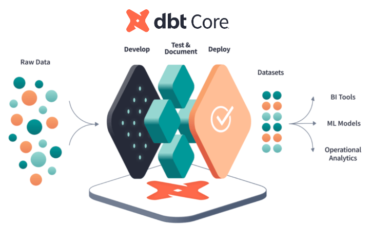

# dbt-core-northwind-project

## Arquitetura moderna utilizando dbt-core e postgres na AWS

Apresentar de forma prática uma solução completa de dados aproveitando os principais módulos e funcionalidades do dbt-core. Toda infra de dados com um Postgres na AWS.



A ferramenta dbt (data build tool) é uma solução inovadora no campo da engenharia de dados, projetada para conectar-se a repositórios de dados centralizados como Data Warehouses e Data Lakes. Ela habilita usuários de negócios, analistas e engenheiros a gerar transformações de dados, regras de negócios e insights valiosos de forma autônoma e eficiente.

## Guia

- Se você é novo com sql, recomendamos que faça até a [aula 05 do bootcamp de SQL](https://github.com/lvgalvao/Northwind-SQL-Analytics/tree/main)
- Se você é novo no dbt-core, recomendo que leia o Guía rápido para criar o seu primeiro modelo

## Jornada de Dados

Esse projeto faz parte da comunidade de estudo Jornada de dados
Nossa missão é **fornecer o melhor ensino em engenharia de dados**


Se você quer:

1) Construir uma **base sólida** em Python e SQL
2) Aprender as **principais habilidades e ferramentas** de engenharia de dados
3) Criar ou melhorar seu **portfólio** de dados
4) Criar ou aumentar o seu **networking** na área
5) Mudar ou dar o **próximo passo em sua carreira**

A **Jornada de Dados** é o seu lugar

## O que é dbt?

O dbt é uma ferramenta focada na transformação de dados dentro de um pipeline de ETL/ELT, onde ETL significa Extrair, Transformar e Carregar. Ele se concentra especificamente no aspecto de Transformação (T), permitindo a criação de fluxos de trabalho de transformação de dados usando SQL.


## Pré-requisitos

Antes de começar, certifique-se de ter os seguintes softwares instalados em seu sistema:

- [Git](https://git-scm.com/downloads): Para clonar o repositório.
- [Docker](https://www.docker.com/products/docker-desktop): Para executar os contêineres do PostgreSQL, pgAdmin e dbt.

## Instruções de Instalação

### 1. Clonar o Repositório

Primeiro, clone este repositório para o seu ambiente local usando Git. Abra um terminal e execute o seguinte comando:

```sh
git clone https://github.com/seu-usuario/dbt-core-northwind-project.git
cd dbt-core-northwind-project
```

### 2. Executar os Contêineres Docker

Com o Docker instalado, navegue até o diretório do projeto clonado e execute os seguintes comandos para iniciar os contêineres:

```sh
docker-compose up --build
```

Isso iniciará os contêineres necessários: PostgreSQL, pgAdmin, dbt-core e dbt-docs.

### 3. Acessar pgAdmin

Uma vez que os contêineres estiverem em execução, você pode acessar o pgAdmin no seu navegador:

- URL: `http://localhost:5050`
- Senha: `postgres`

### 4. Acessar a Documentação do dbt

Para acessar a documentação gerada pelo dbt, abra seu navegador e vá para:

- URL: `http://localhost:8080`

### 5. Conectar ao Banco de Dados

No pgAdmin, adicione um novo servidor com as seguintes configurações:

- Nome: `db`
- Host: `db`
- Porta: `5432`
- Usuário: `postgres`
- Senha: `postgres`

### Estrutura do Projeto

- **dbt**: Contém os arquivos de configuração e scripts do dbt.
- **docker-compose.yml**: Define os serviços Docker necessários para o projeto.
- **profiles.yml**: Configurações do perfil do dbt.

### Comandos dbt

Você pode executar comandos dbt dentro do contêiner `dbt-core`. Para abrir um terminal interativo no contêiner, execute:

```sh
docker exec -it dbt-core /bin/bash
```

Dentro do contêiner, você pode usar comandos dbt, como:

```sh
dbt run
dbt test
```

## Contribuição

Sinta-se à vontade para contribuir com este projeto. Crie um fork, faça suas alterações e envie um pull request.